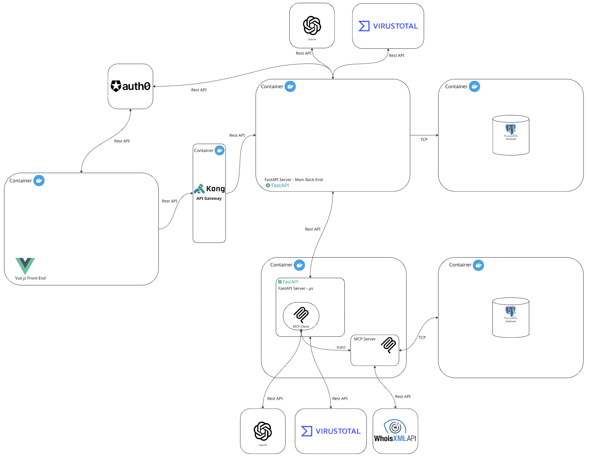

# Cyberthreat Intelligence Agent

**See demo and full case study:** [pedrorodas.com/#projects](https://pedrorodas.com/#projects)

Cyberthreat Intelligence Agent is a multi-service cybersecurity platform for analyzing files, URLs, and IP indicators. It combines threat intelligence providers (VirusTotal and WhoisXMLAPI) with LLM-assisted context generation (OpenAI), and exposes capabilities through a Vue frontend and FastAPI services behind Kong API Gateway.

## Architecture



### VirusTotal data flow

**Direct path (main backend):** Vue.js → Kong → **FastAPI main backend** (`/analyze`) → **VirusTotal API** → **OpenAI** (narrative report) → **PostgreSQL** (analysis logs).

**Agent path (MCP microservice):** Vue.js → Kong → **FastAPI main backend** → **FastAPI µs** (`mcp-client`, `/analyze/`) → **VirusTotal API** (submit URL + poll analysis) → **MCP client** → **OpenAI** (expanded report) → optional **MCP tools** (`export_pdf`, `save_report`).

### WhoisXMLAPI data flow

**MCP-only path:** Vue.js → Kong → **FastAPI main backend** → **FastAPI µs** → **MCP client** → **MCP server** (`whois_lookup`, stdio) → **WhoisXMLAPI** → enriched context merged with VirusTotal data → **OpenAI** → **PostgreSQL** (MCP `reports` table via `save_report`).

### Kong integration

**Kong** is the single public entry point for backend APIs. The Vue app calls `VITE_API_URL` (e.g. `http://localhost:8002/api`); Kong strips the `/api` prefix and forwards traffic to the **main FastAPI** service (`api:8000`). Routing and CORS are defined declaratively in `kong/kong.yml` (DB-less mode in Docker Compose). The **MCP microservice** (`:8001`) is not routed through Kong in the default setup—it is reached internally when the main backend proxies advanced flows.

### Auth0 integration

**Auth0** handles user login for the Vue frontend via `@auth0/auth0-vue` (`Frontend/auth_config.json`: `domain`, `clientId`, `audience`). Protected routes use the Auth0 router guard; the client obtains access tokens (`getAccessTokenSilently`) and sends them as `Authorization: Bearer …` on API calls. The **main backend** validates tokens against Auth0 `/userinfo` and enforces role-based access with custom claims (e.g. `SecurityOps` for `/analyze` and `/logs`, `UserPremium` for `/advanced-analysis`). Kong passes through the `Authorization` header; JWT validation is performed by FastAPI, not by Kong plugins in the current config.

## Key Features

- **Multi-indicator scanning:** Analyze **URLs**, **IP addresses**, and **uploaded files** through VirusTotal.
- **Two analysis modes:**
  - **Standard** (`/analyze`) — VT results + OpenAI summary for quick, readable assessments.
  - **Advanced** (`/advanced-analysis` → MCP microservice) — deeper enrichment, longer technical reports, and PDF output.
- **LLM-powered reporting:** OpenAI turns raw API payloads into structured narratives with risk summaries and mitigation guidance.
- **MCP tool orchestration:** The agent layer calls WHOIS, AbuseIPDB, PDF export, and DB persistence only when the indicator type requires it.
- **Automatic entity routing:** URL flows trigger WHOIS; IP flows trigger AbuseIPDB; file/archive flows use VT data alone.
- **VirusTotal polling:** Waits for queued VT analyses before enrichment so reports use completed scan data.
- **PDF export & storage:** Markdown reports are rendered to PDF and saved in PostgreSQL (`reports` table) with JSON metadata.
- **Audit history:** Query past analyses via `/logs` with filters by type and date range.
- **Role-based access control:** Auth0 roles gate endpoints (e.g. `SecurityOps` vs `UserPremium`).
- **Separated data stores:** Main backend and MCP/agent each use their own PostgreSQL instance.
- **Production-oriented layout:** Kong as API edge, Docker Compose for local stacks, Kubernetes manifests under `k8s/`.

## Tech Stack

- **Frontend:** Vue 3, TypeScript, Vite, Vuetify, Vue Router, Axios, Auth0 Vue SDK
- **Backend services:** Python, FastAPI, Uvicorn, OpenAI SDK, MCP SDK
- **Threat intelligence:** VirusTotal API, WhoisXMLAPI
- **Data layer:** PostgreSQL (separate DB instances for services)
- **Gateway and platform:** Kong, Docker, Docker Compose, Kubernetes manifests
- **Ops utilities:** Adminer

## Repository Structure

```text
.
├── Backend/                # FastAPI service for VirusTotal-focused workflows
│   ├── config/
│   ├── Dockerfile
│   └── requirements.txt
├── Frontend/               # Vue application
│   ├── src/
│   ├── auth_config.json
│   ├── Dockerfile
│   └── package.json
├── mcp-client/             # FastAPI service integrating MCP-based flows
│   ├── main.py
│   ├── Dockerfile
│   └── requirements.txt
├── mcp-server/             # MCP server (stdio tools for the agent)
│   ├── mcp_server.py       # Tool definitions and server entrypoint
│   ├── pyproject.toml
│   ├── requirements.txt
│   └── uv.lock
├── kong/                   # Kong declarative config
│   └── kong.yml
├── pg_db/                  # DB init scripts
│   └── init.sql
├── k8s/                    # Kubernetes manifests for deployment
├── docker-compose.yml
└── README.md
```

## MCP Tools

The MCP server (`mcp-server/mcp_server.py`) exposes the following tools to the LLM via the MCP client. The server runs over **stdio** and is invoked by the `mcp-client` FastAPI service.

| Tool | Description |
|------|-------------|
| `whois_lookup` | Fetches fresh WHOIS data for a domain from **WhoisXMLAPI**. |
| `abuse_ipdb_lookup` | Retrieves IP reputation and abuse reports from **AbuseIPDB** (last 90 days). |
| `export_pdf` | Converts a markdown threat report into a PDF (via markdown2 + WeasyPrint). |
| `save_report` | Persists the analyzed indicator, structured report JSON, and PDF bytes to **PostgreSQL** (`reports` table). |

**Environment variables used by MCP tools** (set in `mcp-client/.env` or the MCP server runtime):

- `WHOIS_API_KEY` — WhoisXMLAPI
- `ABUSEIPDB_API_KEY` — AbuseIPDB
- `DATABASE_URL` — PostgreSQL connection for `save_report`

## Prerequisites

- [Docker Desktop](https://docs.docker.com/get-docker/)
- VirusTotal API key
- OpenAI API key
- WhoisXMLAPI key
- AbuseIPDB API key (for MCP `abuse_ipdb_lookup`)
- Auth0 tenant + application (for frontend auth setup)

## Setup and Running

### 1) Clone the Repository

```bash
git clone https://github.com/da-ros/Cyberthreat-Intelligence-Agent.git
cd Cyberthreat-Intelligence-Agent
```

### 2) Prepare Environment Files

Create these files before starting containers:

1. `Backend/.env`
2. `mcp-client/.env`
3. Root `.env` (required by `docker-compose.yml`; leave it blank)

> Important: Do not commit `.env` files to git.

### 3) Configure `Backend/.env`

Use the following values as a baseline:

```env
OPENAI_KEY=your-openai-api-key
VT_KEY=your-virustotal-api-key
DATABASE_URL_API=postgresql://postgres:postgres@db:5432/virustotaldb
AUTH0_CLIENT_ID=your-auth0-client-id
AUTH0_DOMAIN=your-auth0-domain
```

### 4) Configure `mcp-client/.env`

Use:

```env
OPENAI_API_KEY=your-openai-api-key
VT_API_KEY=your-virustotal-api-key
DATABASE_URL=postgresql://pguser:pgpass@db_mcp:5432/cybersec
MCP_SERVER_CMD=python mcp_server.py
WHOIS_API_KEY=your-whoisxmlapi-key
ABUSEIPDB_API_KEY=your-abuseipdb-api-key
```

### 5) Configure Frontend Auth0

Update `Frontend/auth_config.json` with your Auth0 values:

- `domain`
- `clientId`
- `audience`

The audience should match the backend API identifier configured in Auth0.

### 6) Build and Start the Stack

From the project root:

```bash
docker compose up --build -d
```

What this does:

- `--build` rebuilds images from Dockerfiles.
- `-d` runs everything in detached/background mode.

### 7) Verify Services

After startup, expected local endpoints are:

- **Kong proxy:** `http://localhost:8002`
- **Kong admin:** `http://localhost:8003`
- **VT backend (direct):** `http://localhost:8000`
- **MCP client backend (direct):** `http://localhost:8001`
- **Adminer:** `http://localhost:8081`
- **Frontend (Docker):** `http://localhost:3000`

### 8) Stop Services

Stop all services:

```bash
docker compose down
```

Stop and remove volumes (this clears DB data):

```bash
docker compose down -v
```

Notes:
- `docker compose` is the modern Compose CLI.
- If you see a warning about `version` in `docker-compose.yml`, it is safe but you can remove the field.

## API Surface (High Level)

Primary routes are exposed through Kong (`http://localhost:8002`) and mapped in `kong/kong.yml`, with backend handlers in `Backend/main.py` and `mcp-client/main.py`.

Common routes include:

- `GET /logs`
- `POST /analyze`
- `POST /advanced-analysis`

## Security Notes

- Never commit `.env` files or production secrets.
- Validate Auth0 JWT enforcement status before production exposure.
- Restrict Kong Admin API access outside local/dev networks.

## License

MIT
